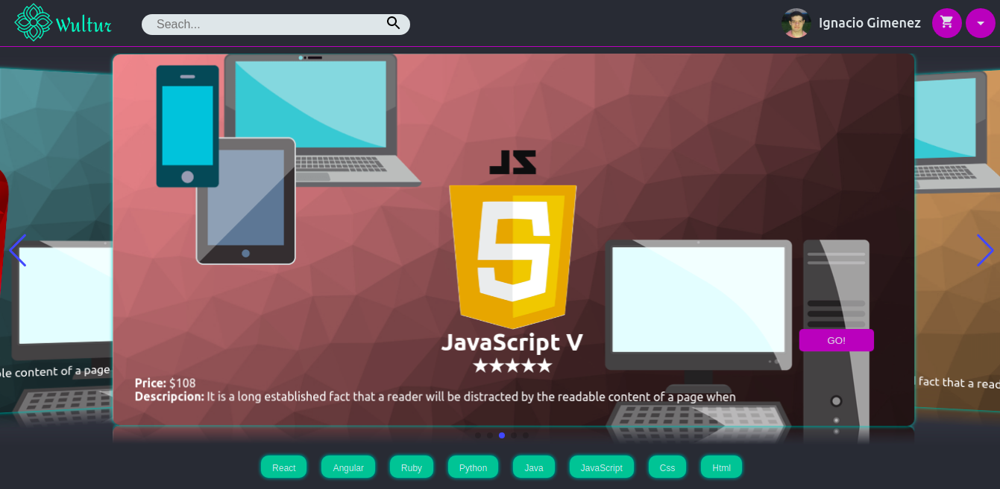
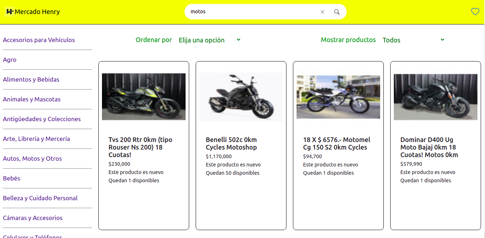
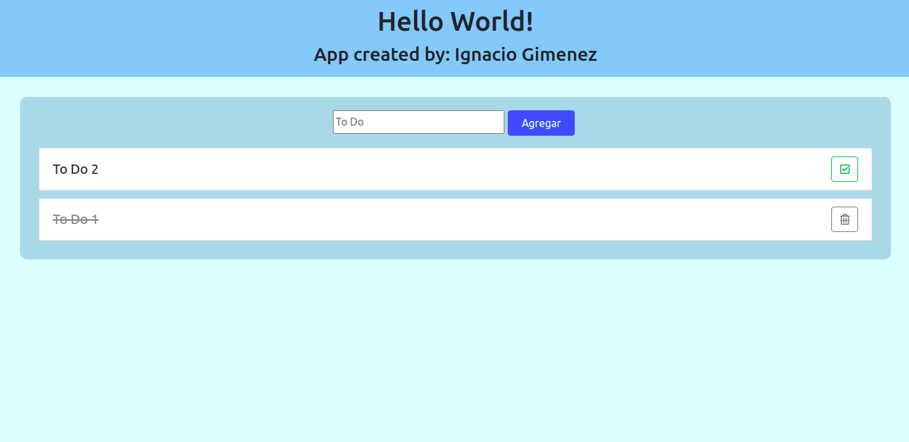

# Hi, i'm Ignacio 👋

```js
const Ignacio = {
  fullName: 'Ignacio Gimenez',
  nickName: 'Nacho',
  code: ['HTML', 'CSS', 'JavaScript', 'TypeScript'],
  tools: ['React', 'React Native', 'Redux', 'Express', 'Node', 'postgreSQL', 'Firebase']
}
```

- 💻 I’m currently working on [ITCI](https://www.linkedin.com/company/hi-itci/) 
- 🤓 I’m currently learning Java 

<div style="display: flex;
  justify-content: space-around;"
>
  <a href="https://www.linkedin.com/in/ignacio-gimenez-305799184/" target="_blank">
    <div
      style="display: flex;
      align-items: flex-end;
      justify-content: center;
      background: white;
      width: 150px;
      border-radius: 30px"
    >
      
      <h2 style="font-weight: 500;
      color: black;"
      >LinkedIn</h2>
    </div>
  </a>

  <a href="https://github.com/Nacho077" target="_blank">
    <div
      style="display: flex;
      align-items: flex-end;
      justify-content: center;
      background: white;
      width: 150px;
      border-radius: 30px"
    >
      
      <h2 style="font-weight: 500;
      color: black;"
      >Github</h2>
    </div>
  </a>

  <a href="mailto:ignaciogimenez70@gmail.com" target="_blank">
    <div
      style="display: flex;
      align-items: flex-end;
      justify-content: center;
      background: white;
      width: 150px;
      border-radius: 30px"
    >
      
      <h2 style="font-weight: 500;
      color: black;
      margin-left: 10px"
      >Email</h2>
    </div>
  </a>
</div>


-------

## Some projects

### [Wultur](https://wultur.herokuapp.com/)
[](https://wultur.herokuapp.com/)
A challenge from Henry to make an complete e-commerce

### [Mercado Henry](https://github.com/Nacho077/MercadoHenry)
[](https://github.com/Nacho077/MercadoHenry)
A challenge from Henry to make an Mercado Libre product finder

### [To Do List](https://nacho077.github.io/ToDoList/)
[](https://nacho077.github.io/ToDoList/)
A simple To Do List 

