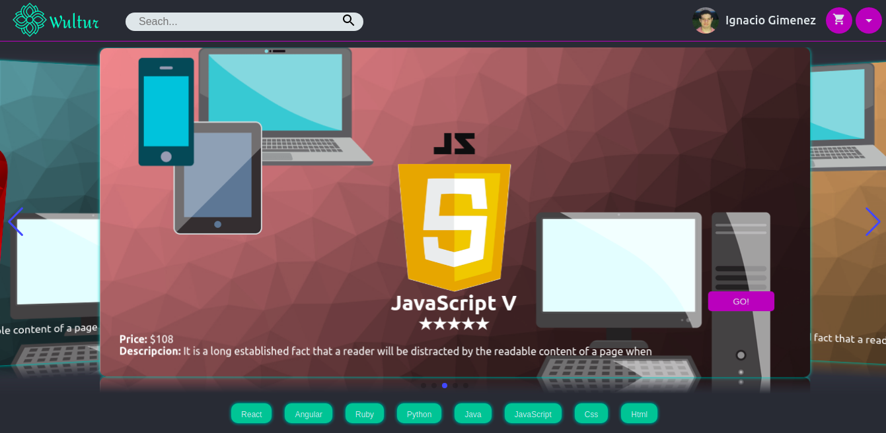
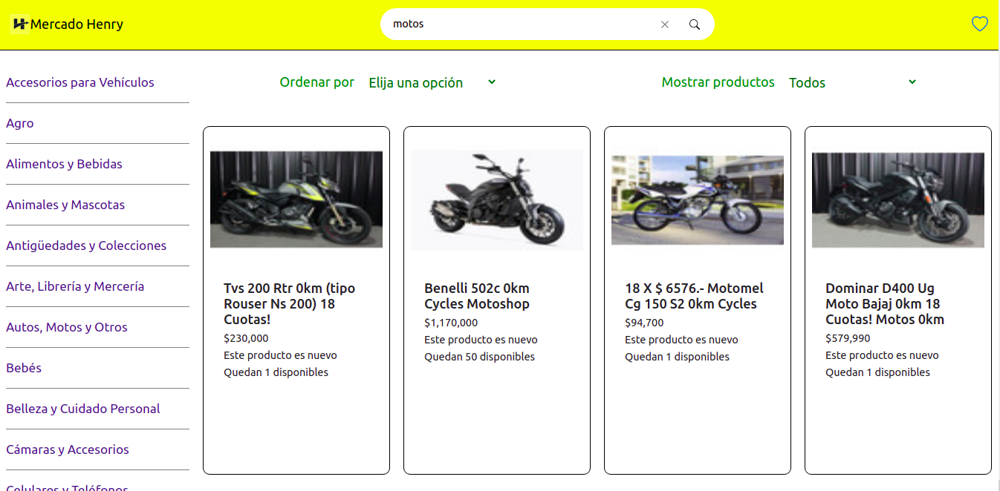

### Hi, i'm Ignacio 👋

```js
const Ignacio = {
  fullName: 'Ignacio Gimenez',
  nickName: 'Nacho',
  code: ['JavaScript', 'HTML', 'CSS'],
  tools: ['React', 'Redux', 'Express', 'Node', 'postgreSQL']
}
```
-------
I'm actually workin in a project of e-commerce with methodologies Ágiles and using postgreSQL, ExpressJS, ReactJS, NodeJS, Redux and Sequelize with a little group of partners of Henry \
You can see our progress [here](https://ecommerce-ft06-g08.herokuapp.com/)

---------

## Some projects

### [Wultur](https://wultur.herokuapp.com/)
[](https://wultur.herokuapp.com/)
A challenge from Henry to make an complete e-commerce

### [Mercado Henry](https://github.com/Nacho077/MercadoHenry)
[](https://github.com/Nacho077/MercadoHenry)
A challenge from Henry to make an Mercado Libre product finder

### [To Do List](https://nacho077.github.io/ToDoList/)
[](https://nacho077.github.io/ToDoList/)
A simple To Do List 

## You can contact me in
- [Linkedin](https://www.linkedin.com/in/ignacio-gimenez-305799184/)
- ignaciogimenez70@gmail.com
