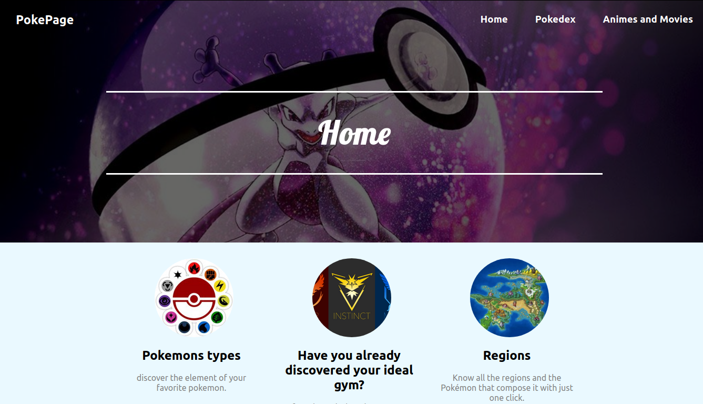

# Hi, i'm Ignacio 👋

```js
const Ignacio = {
  fullName: 'Ignacio Gimenez',
  nickName: 'Nacho',
  code: ['HTML', 'CSS', 'JavaScript', 'TypeScript', 'Java', 'Go', 'Python'],
  tools: ['React', 'React Native', 'Redux', 'Express', 'Node', 'postgreSQL', 'Firebase', 'Spring Boot', 'Gin']
}
``` 

[](https://www.linkedin.com/in/ignacio-gimenez-305799184/)
[](https://github.com/Nacho077)
[](mailto:ignaciogimenez70@gmail.com)

## [Portfolio](https://ignacio-gimenez.vercel.app/)
[](https://ignacio-gimenez.vercel.app/)

-------

## Personal projects

## [Wultur]()
[](https://wultur.herokuapp.com/)
Complete E-commerce with React, Redux, Express and ProstgreSQL

## [PokePage](https://nacho077.github.io/PokePage/)
[](https://nacho077.github.io/PokePage/)
App created with React for practice TypeScript with pokemons

## [Henry World]()
[]()<br/>
App created with React Native using Firebase from database

## [Mercado Henry]()
[]()
Finder of product with React, Redux, Express and PostgreSQL

